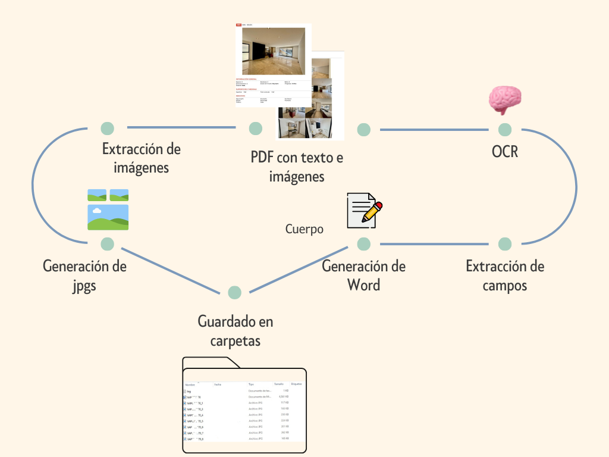

---

## ✨ Características destacadas

- ✅ Extracción precisa de datos desde texto estructurado
- ✅ Separación clara de imágenes útiles (excluye logos, encabezados)
- ✅ Identificación automática de secciones clave
- ✅ Diseño visual mejorado en Word (ideal para WhatsApp o impresión)
- ✅ Nomenclatura consistente de archivos e imágenes

---

## 🔄 Proceso

A continuación se muestra el flujo completo del sistema, desde la entrada del PDF hasta la salida organizada en carpetas:

Puedes revisar también un ejemplo del script que ejecuta este flujo:

📄 [Ver script de ejemplo (generar_fichas.py)](./generar_fichas.py)

---

## 🔧 Posibles mejoras

- Integrar tabla de resumen general por propiedad (Excel)
- Conexión con CRM para subir fichas automáticamente
- Generar también versión PDF final optimizada
- Multilenguaje o salida en HTML para web

---

## 👤 Autoría

Este proyecto fue diseñado e implementado por **Karina**, como parte de su portafolio profesional enfocado en automatización y soluciones prácticas para negocios inmobiliarios.

📫 [Contáctame](https://wa.me/525539666431) si te interesa una solución similar para tu empresa.

